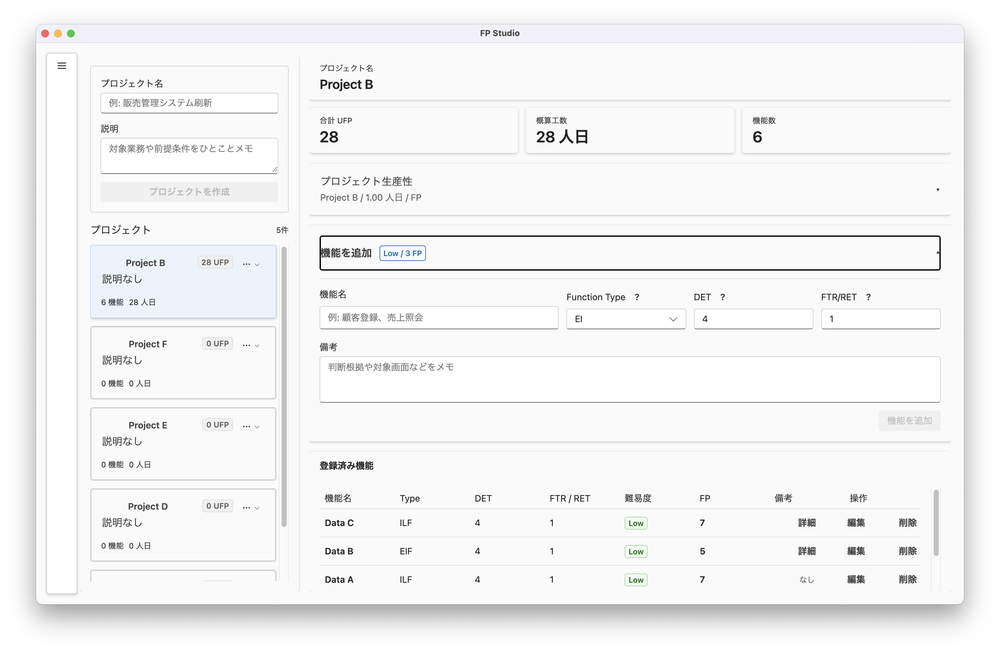

# FP Studio

## Estimate, purely.

FP Studioは、ソフトウェア開発の規模計測を、もっともシンプルで、もっとも正確な体験へと変えるデスクトップアプリケーションです。IFPUGの標準的なファンクション・ポイント（FP）法を、洗練されたインターフェイスに凝縮しました。

- **Precision.** DETとFTRを入力するだけで、複雑度を自動判定。
- **Native.** デスクトップならではの軽快なレスポンス。
- **Private.** 重要な見積もりデータは、ローカルのSQLiteに安全に保存。
- **Standard.** IFPUG準拠のロジックを搭載。

## これは何ができるアプリ？

FP Studioは、業務システムや業務アプリの規模をファンクション・ポイント法で見積もるためのデスクトップアプリです。プロジェクトを作成し、EI / EO / EQ / ILF / EIFごとの機能を登録すると、難易度・UFP・概算工数をまとめて確認できます。

主な用途は次のとおりです。

- 要件定義や見積作成時の初期規模把握
- 複数機能を横並びで整理しながらのFP計測
- チーム内での見積根拠の明文化
- ローカル保存によるオフライン前提の安全な運用

## 主な機能

- プロジェクトの作成、選択、削除
- Function TypeごとのFPエントリ登録
- DET / FTR / RETの入力による難易度自動判定
- 合計UFPの自動集計
- 生産性設定に基づく概算工数の自動計算
- SQLiteによるローカル永続化

## 使い方

基本的な流れは次の4ステップです。

1. プロジェクト名を入力して見積対象の案件を作成します。
2. 画面右側のフォームから機能名、Function Type、DET、FTRまたはRETを入力します。
3. 自動判定された難易度とFPを確認して、機能を追加します。
4. 画面上部の集計カードで合計UFPと概算工数を確認します。

生産性設定を変更すると、UFPはそのままに工数だけを再計算できます。また、登録したプロジェクトや機能はアプリを再起動しても保持されます。

## インストール方法

配布済みのアプリは、GitHub Releasesからダウンロードして利用できます。

- [Releases - neko3cs/FP-Studio](https://github.com/neko3cs/FP-Studio/releases)

お使いのOS向けの配布ファイルを取得し、展開またはインストールして起動してください。通常利用であれば、ソースコードの取得や手動ビルドは不要です。起動後の操作は、上記の「使い方」に沿って進められます。

## データ保存先

FP StudioはローカルのSQLiteを使ってデータを保存します。

- macOS: `~/Library/Application Support/FP Studio/`
- Windows: `~/AppData/Roaming/FP Studio/`

業務データをクラウドへ送信しないため、社内見積や機微な要件情報もローカル中心で扱えます。

## トラブルシューティング

### アプリが起動しない・開けない場合

- ダウンロードしたファイルがお使いのOS向けか確認してください。
- 以前の版が残っている場合は、いったん削除して最新のリリースを入れ直してください。
- セキュリティ警告が表示された場合は、OSの設定画面からアプリの実行許可を確認してください。

### 保存データが見つからない場合

- 保存先は上記の「データ保存先」を確認してください。
- アプリの再インストール後も、同じユーザー領域にデータが残っている場合があります。

## 補足

このアプリは、FP計測の入力負荷を下げつつ、見積の根拠を残しやすくすることを目的にしています。まずは小さな案件で試し、チームの見積ルールに合わせて生産性設定を調整しながら使うのがオススメです。

## 開発者向け情報

詳細な開発や検証、配布手順は `src/README.md` にまとめています。ソースコードやテストに関わる作業の際はそちらを参照してください。

## 免責事項

本製品の利用により発生した直接的または間接的な損害（見積りの差異、データ損失、運用上の不都合等）について、開発者または配布者はいかなる責任も負いません。利用者は自己の責任において本アプリケーションを導入・使用するものとし、必要に応じて別途バックアップや検証手順を講じてください。
